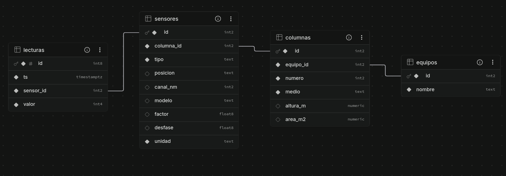

# Telemetría de columnas filtrantes

Registro automático de lo que pasa dentro de columnas de filtración de agua en un
laboratorio de química: cuánto caudal pasa por cada una y, más adelante, cuánta
presión se pierde en el lecho y qué concentración sale.

Cada equipo tiene una placa ESP8266 que lee sus sensores y cada minuto manda las
lecturas a una base de datos PostgreSQL.

```
sensores  →  WeMos D1 (ESP8266)  →  Supabase (PostgreSQL)  →  gráficas
```

## Estado

| Parte | Estado |
|---|---|
| Caudal | Funciona. Falta calibrar con agua |
| Envío a la base de datos | Funciona |
| Presión | Esperando hardware |
| Espectro | Por definir |
| Visualización | Pendiente |

## Hardware

- WeMos D1 R1 (ESP8266)
- 4 caudalímetros FS300A
- Por agregar: sensores de presión con ADC ADS1115 y sensor espectral AS7341


Pines, alimentación y calibración en [docs/caudalimetros.md](docs/caudalimetros.md).

## Base de datos



Tres tablas describen el montaje (equipos, columnas y sensores) y una guarda las
lecturas.

Se guarda el valor crudo que manda la placa: pulsos o cuentas del ADC. La
conversión a L/min o kPa se hace al consultar, con la calibración de cada sensor.
Así, si una calibración estaba mal, se corrige en un solo lugar y los datos
históricos no se tocan.

La hora de cada lectura la pone el servidor. Todo lo que llega en un mismo envío
queda con la misma hora, lo que permite cruzar caudal y presión del mismo
instante.

La placa solo puede insertar. No puede modificar ni borrar lecturas.

Esquema completo en [db/esquema.sql](db/esquema.sql).

## Estructura

```
src/
├── main.cpp
├── sensores/       lectura de sensores
├── red/            WiFi y envío a la base
└── include/        credenciales
db/                 esquema SQL y peticiones de prueba
docs/               documentación y diagramas
```

## Uso

Se compila con [PlatformIO](https://platformio.org/):

```bash
pio run              # compila y sube a la placa
pio device monitor   # ver la salida serial
```

Antes, copia `src/include/secretos.h.ejemplo` como `secretos.h` y llena los
datos del WiFi y de Supabase. La placa solo se conecta a redes de 2.4 GHz.