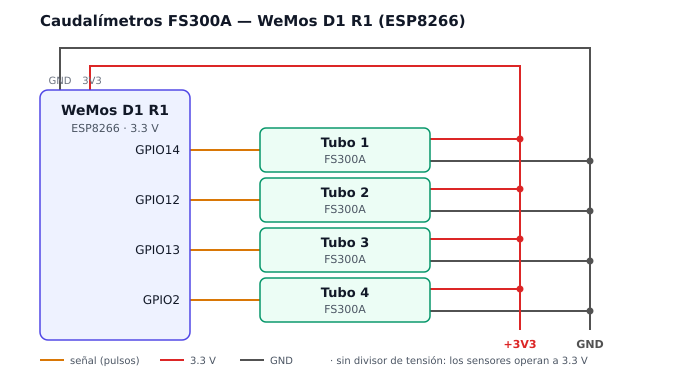

# Caudalímetros

Lectura de caudal en las columnas de filtración mediante sensores de turbina
sobre un nodo ESP8266.

> Este documento cubre únicamente el subsistema de caudal. Los sensores de
> presión y espectrales se documentarán cuando estén definidos.



## Principio de medición

El FS300A lleva una turbina con un imán en su interior. El paso del fluido la
hace girar, y en cada vuelta el imán pasa frente a un sensor de efecto Hall que
emite un pulso. La frecuencia de pulsos es proporcional al caudal.

El sensor no mide caudal directamente: lo cuenta. Convertir pulsos a litros por
minuto requiere una constante de calibración propia de cada unidad.

## Hardware

| Componente | Modelo | Cantidad |
|---|---|---|
| Microcontrolador | WeMos D1 R1 (ESP8266) | 1 |
| Caudalímetro | FS300A, G3/4" | 4 |

### FS300A

| Parámetro | Valor |
|---|---|
| Rango de caudal | 1-60 L/min |
| Presión de trabajo | < 1.2 MPa |
| Tensión de operación | 3.5-24 V DC (según etiqueta) |
| Salida | Pulsos, efecto Hall |
| Cableado | Rojo = VCC, negro = GND, amarillo = señal |

**Límite inferior.** Por debajo de 1 L/min la turbina no arranca y el sensor
reporta cero, no un valor bajo. Si el caudal de operación de las columnas cae
por debajo de ese umbral, este sensor no sirve en ese punto.

## Alimentación

Los sensores operan correctamente a **3.3 V**, pese a que la etiqueta declara un
mínimo de 3.5 V. Verificado en banco: la turbina arranca y los pulsos llegan al
GPIO sin acondicionamiento.

Esto permite conectarlos directo a la placa. **No se requiere divisor de
tensión.**

Si por algún motivo se alimentan a 5 V, el divisor pasa a ser obligatorio: 2.2 kΩ
en serie sobre la línea de señal y 3.3 kΩ de ahí a GND, lo que entrega 3.0 V. El
ESP8266 no tolera 5 V en sus GPIO y se daña de forma permanente.

Los cuatro sensores suman unos 60 mA sobre el regulador de 3.3 V de la placa. Si
aparecen reinicios aleatorios con el WiFi activo, la causa es el pico de consumo
combinado y se resuelve con fuente externa.

## Mapeo de pines

| Tubo | GPIO | Etiqueta frontal de la placa |
|---|---|---|
| 1 | GPIO14 | D13/SCK/D5 |
| 2 | GPIO12 | D12/MISO/D6 |
| 3 | GPIO13 | D11/MOSI/D7 |
| 4 | GPIO2 | D9/TX1 |

La WeMos D1 R1 tiene doble serigrafía: el frente usa la numeración del Arduino
Uno para aceptar shields, el reverso usa el GPIO real. **El código siempre
referencia el número de GPIO.**

## Pines descartados

| Pin | Motivo |
|---|---|
| GPIO0 | Pin de arranque. Debe estar en HIGH al bootear; en LOW entra en modo flash. |
| GPIO15 | Pin de arranque. Debe estar en LOW al bootear. `INPUT_PULLUP` lo deja en HIGH y la placa no arranca. |
| GPIO16 | No soporta `attachInterrupt`. Responde a otro bloque de hardware (deep sleep). |
| GPIO4, GPIO5 | Reservados para el bus I2C de los sensores que faltan. |
| A0 | Entrada analógica, no funciona como digital. |

**GPIO2 es un caso especial.** También es pin de arranque, pero requiere HIGH al
bootear, que es justamente lo que `INPUT_PULLUP` le da. El sensor solo lo lleva a
LOW mientras la turbina gira, y al encender no hay flujo. Además tiene el LED de
la placa conectado, así que parpadea con el caudal del tubo 4.

## Calibración

**Pendiente.** La constante de pulsos por litro está en disputa entre fuentes:

| Fuente | Constante | Pulsos/L |
|---|---|---|
| hi-ip | f = 5.5 · Q | 330 |
| Zhongjiang (fabricante) | f = 6 · Q | 360 |
| Tipa | f = 7.5 · Q | 450 |

El propio fabricante advierte que no es un instrumento de precisión y que la
respuesta varía con caudal, presión y orientación de montaje.

Por eso el firmware transmite **pulsos crudos** y la conversión a L/min se
aplica aguas abajo. Guardar el valor crudo permite recalcular si la constante
cambia; guardar solo el valor convertido haría irrecuperables los datos ante un
error de calibración.

Procedimiento: cronómetro, recipiente y báscula. Se mide la masa de agua
recolectada en un intervalo conocido y se despeja la constante para cada unidad.

## Firmware

```
firmware/src/
├── main.cpp              setup, loop, salida por serial
└── caudalimetro.{h,cpp}  ISR, contadores y snapshot
```

La interfaz pública son dos funciones:

```cpp
void caudalimetroInit();
void caudalimetroSnapshot(uint32_t destino[CAUDAL_N]);
```

`main.cpp` no conoce los pines ni la existencia de interrupciones. Solo pide un
snapshot.

### Decisiones de implementación

**`IRAM_ATTR` en cada ISR.** Obligatorio en ESP8266. El código reside en flash y
se carga por demanda; si una interrupción ocurre mientras el chip lee flash y la
rutina también está en flash, el sistema aborta. `IRAM_ATTR` fuerza a que la
función viva en RAM.

**Sección crítica al leer los contadores.** `caudalimetroSnapshot()` desactiva
interrupciones mientras lee y reinicia cada contador, de modo que ambas
operaciones sean indivisibles. Sin esa protección, un pulso que llegue entre la
lectura y el reinicio se descarta sin dejar rastro. La ventana es de
nanosegundos, así que el fallo es raro e invisible: corrompe datos en silencio
en lugar de producir un error.

**Snapshot único por ciclo.** `caudalimetroSnapshot()` reinicia los contadores,
por lo que llamarlo dos veces en el mismo ciclo hace que el segundo consumidor
lea casi cero. El snapshot se toma una vez en `loop()` y el arreglo resultante
se pasa a quien lo necesite.

**Temporizador no bloqueante.** El intervalo se controla con
`millis() - t0 >= 1000` en lugar de `delay()`. Un `delay()` en `loop()` congela
el procesador e interfiere con la pila de WiFi.

**Un solo temporizador para todos los sensores.** Cuando se sumen los sensores
de presión, sus lecturas deben corresponder al mismo instante que el caudal para
que los cálculos derivados tengan sentido. Todas las lecturas comparten tick y
timestamp.

## Compilar y flashear

Requiere [PlatformIO](https://platformio.org/).

```bash
cd firmware
pio run              # compila y sube a la placa
pio device monitor   # monitor serial, 115200 baud
```

El usuario debe pertenecer al grupo `dialout` para acceder a `/dev/ttyUSB0`:

```bash
sudo usermod -aG dialout $USER
```

El cambio de grupo solo aplica tras reiniciar sesión. Verificar con `id -nG`.

### Credenciales

`src/secretos.h` contiene el SSID y la contraseña de WiFi y **no se versiona**.
Copiar `secretos.h.ejemplo` y completarlo.

## Salida actual

Por serial, una línea por segundo:

```
tubo1=238 tubo2=0 tubo3=0 tubo4=0
```

Los valores son pulsos acumulados en el último segundo, sin convertir.